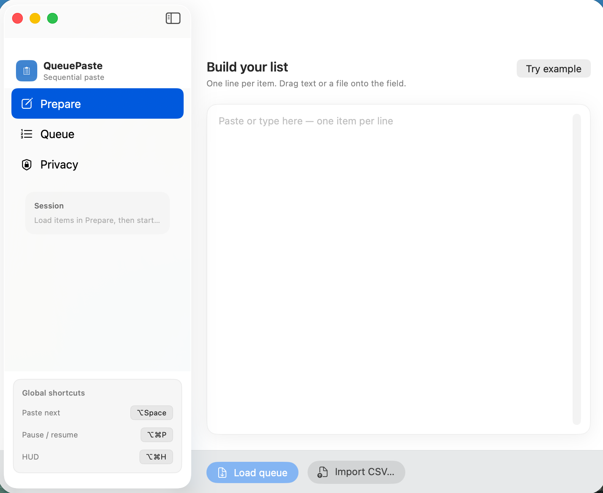
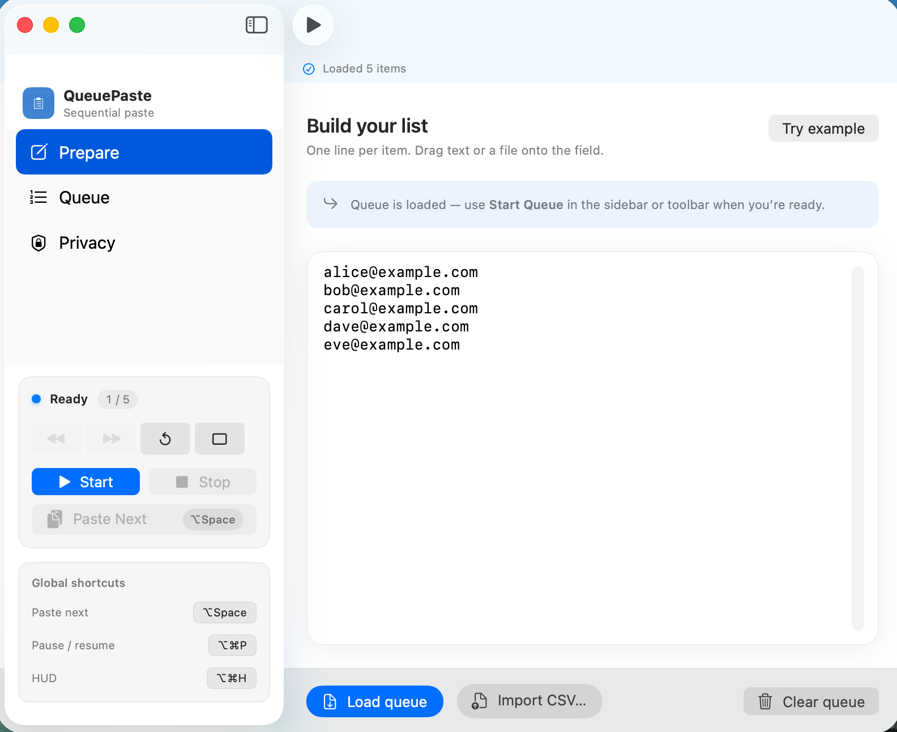
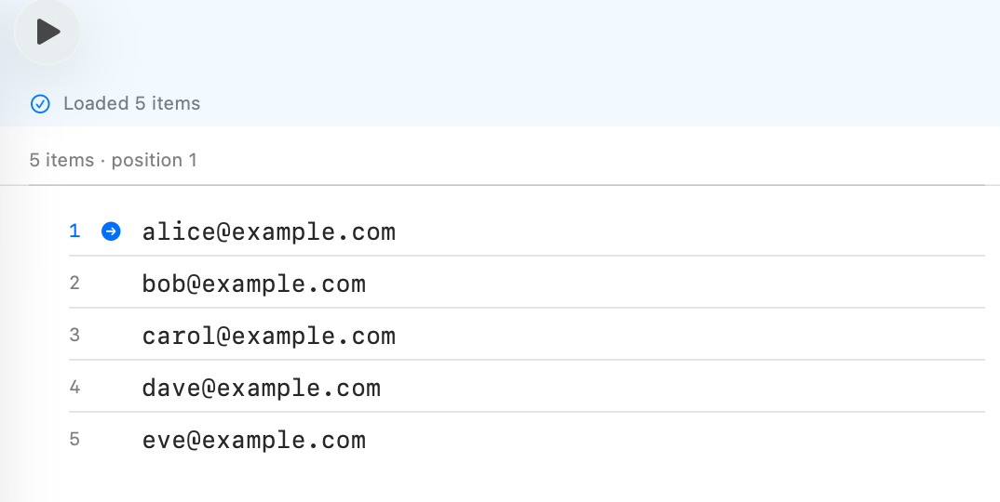
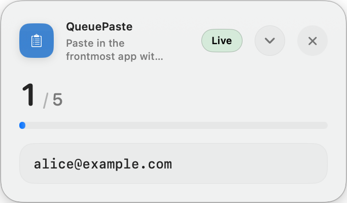
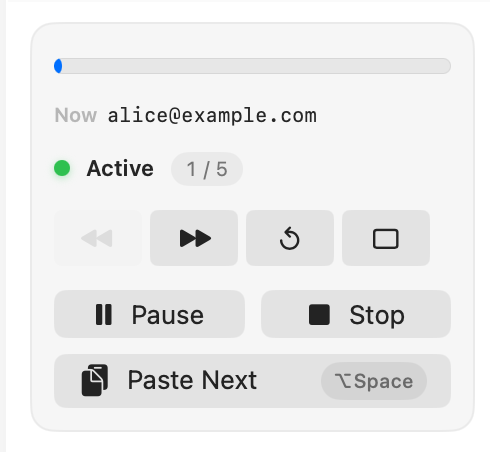

# QueuePaste

<p align="center">
  
</p>

[](https://developer.apple.com/macos/)
[](https://developer.apple.com/swift/)
[](LICENSE)

## Why

I work as an automation assistant on campus. I often need to paste a list of names one at a time—about **1000+ names a day**. While there are options to automate uploads with Selenium among others, **student data security** matters more, and the database is locked from external automation.

**QueuePaste** lets me copy whole lists at once, then use **⌥ Space** to paste each item into the target database search tool, one at a time.

It took a **2-hour** data entry task down to **20 minutes**—roughly a **6×** speedup.

**copy → switch app → paste → repeat**  
Every context switch costs focus and time. Multiply that by a thousand names.

QueuePaste removes that loop: **load your list once**, then one hotkey advances through each item sequentially into **any** app.

---

**QueuePaste** is a native, lightweight, and highly performant utility for macOS designed to sequentially paste items from a loaded list across any target application with a single global hotkey. It is engineered with robust security, state preservation, and zero-context-switching in mind.

QueuePaste was built to eliminate the repetitive strain and error-prone nature of copying and pasting hundreds of text payloads repeatedly into target applications (e.g., rigid databases, internal campus portals, and restricted CRM platforms) that do not support automated API integration.

---

## Key Features

- **Global Execution:** Register `⌥ Space` across macOS to advance the paste queue in the foreground application when the queue is active.
- **HUD (Heads-Up Display):** A floating window above other apps for current item and progress. Toggle with the menu or `⌥⌘H` when the queue is running.
- **Clipboard HUD (universal widget):** Command-Shift-V opens a separate floating clipboard HUD (`ClipboardHUDCoordinator`) for quick access without leaving the focused app.
- **Clipboard Workspace:** A dedicated area in the main window (sidebar: Workspace) plus Command-Shift-B for dump, inbox, buckets, staging, and queue-oriented workflows. Clipboard history is stored locally (SQLite metadata under Application Support, image bodies on disk) with passive capture and optional manual dump (`⌃⌥D`). Capture pause toggles with `⌃⌥C` when passive capture is enabled.
- **Deep System Integration:** `CGEvent` taps and `NSPasteboard` automation for hotkeys and paste simulation (requires Accessibility permission).
- **State Continuity:** Queue sessions persist via `UserDefaults` through `QueueSessionStore` for recovery across restarts.
- **Data Ingestion:** Multi-line text and comma-separated `.csv` import for the paste queue.

### Releases vs. this repository

Published builds (DMG, Homebrew cask, installer script) track the **stable** line on `main`. Larger clipboard-workspace and inbox features may land on a **feature branch** first; check branch names and recent commits when building from source. Building from Xcode always reflects the branch you have checked out.

---

## System Architecture

QueuePaste adheres strictly to the **MVVM (Model-View-ViewModel)** architectural pattern, leveraging Apple's modern concurrency paradigms (`@MainActor`) and the Swift 5.10 `@Observable` macro to power real-time UI synchrony.

### Sub-Domain Documentation

For an engineering deep route into the internal mechanisms of this engine, please consult the directory-level Readmes:

- **[Models (Data Domain)](QueuePaste/Models/README.md):** The primitives governing state logic, Codable continuity payloads, and session structures.
- **[ViewModels (State Presentation)](QueuePaste/ViewModels/README.md):** The Source of Truth acting as the principal conductor bridging user interactions to systemic low-level execution.
- **[Views (SwiftUI Interface)](QueuePaste/Views/README.md):** Windowing infrastructure, main navigation, HUD and Clipboard Workspace panels.
- **[Services (AppKit/CoreFoundation Int)](QueuePaste/Services/README.md):** Pure Swift wrappers bridging system accessibility rights, memory pasteboards, and `CGEvent` tap interceptors.

---

## Getting Started

### Prerequisites

To compile and execute this macOS binary, your environment must meet the following criteria:

- **macOS:** version 13.0 (Ventura) or later.
- **Xcode:** version 15.0 or later (with macOS SDK 14.0+).
- **Swift:** version 5.10.

### Build Instructions

1. **Clone the Repository:**
   ```bash
   git clone https://github.com/tmarhguy/QueuePaste.git
   cd QueuePaste
   ```

2. **Open the Project:**
   Locate and open the Xcode Project file (`QueuePaste.xcodeproj`) to instantiate the workspace.
   ```bash
   open QueuePaste.xcodeproj
   ```

3. **Compile & Run:**
   - Select your valid local internal Mac hardware as the active run destination.
   - Execute **Product > Run** (`⌘R`).

### Permissions and Accessibility

Due to the nature of global hotkey interceptions and keystroke simulations, QueuePaste fundamentally relies on macOS Accessibility frameworks.
Upon initial invocation of the global execution hotkey (`⌥Space`), the application will transparently prompt standard OS security dialogs to grant authorization. 

If this bypasses silently, engineers can enforce the configuration via:
**System Settings > Privacy & Security > Accessibility > [Toggle QueuePaste On]**

---

## Visual Tour

QueuePaste is composed of lightweight utility panes. 

### Foundation Loading
<p align="left">
  
  
</p>

### Execution Monitoring Layer
<p align="center">
  
  
</p>

### Global Context Management
<p align="center">
  
</p>

---

## Deployment & Distribution

### Download (current release)

Pre-built macOS disk image:

- **[QueuePaste.dmg](https://github.com/tmarhguy/QueuePaste/releases/latest/download/QueuePaste.dmg)** (from [GitHub Releases](https://github.com/tmarhguy/QueuePaste/releases))

Open the DMG, drag **QueuePaste** into **Applications**, and launch from there. On first run, macOS may show Gatekeeper prompts depending on notarization and your security settings.

#### Install from the terminal

1. **Homebrew**
   ```bash
   brew tap tmarhguy/queuepaste https://github.com/tmarhguy/QueuePaste
   brew install --cask queuepaste
   ```

2. **curl**
   ```bash
   curl -fsSL https://raw.githubusercontent.com/tmarhguy/QueuePaste/main/install.sh | bash
   ```

### Build a DMG locally

The repository includes [`build_dmg.sh`](build_dmg.sh), which archives the Xcode project and packages `QueuePaste.app` into a DMG using [create-dmg](https://github.com/create-dmg/create-dmg) (`brew install create-dmg`). You need a valid Apple Developer signing setup for archive/export steps to succeed on your machine.

QueuePaste is also distributed as source for engineers who prefer to build in Xcode (see **Build Instructions** above).

---

## License

This architecture is released securely under the **MIT License**.
See [LICENSE](LICENSE) for categorical declarations.

---

## About the Author

**Hi, I'm Tyrone Marhguy** (Penn Engineering '28). I build systems from first principles. Whether designing discrete-transistor ALUs with 3,400+ transistors, routing ASIC tapeouts, or architecting 3D websites and native macOS software, my goal is to bridge the gap between raw silicon and elegant desktop utilities.

<div align="center">

[](https://linkedin.com/in/tmarhguy) [](mailto:tmarhguy@gmail.com) [](https://tmarhguy.com) [](https://github.com/tmarhguy)

</div>
